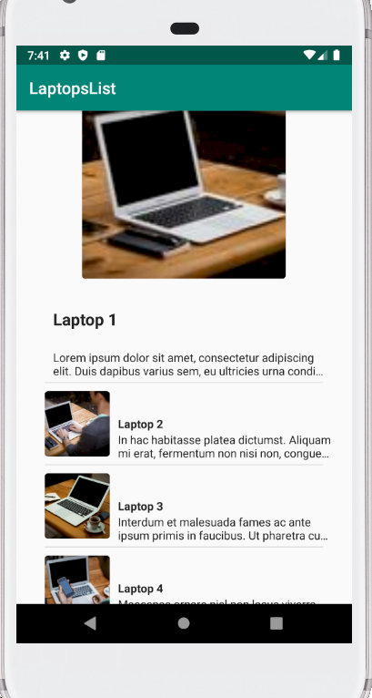
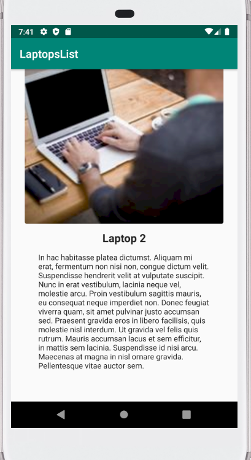

# globallogic

<b>Proyecto de prueba LaptopsList </b>

 

<b>Consideraciones de diseño: </b>

1) En primer lugar, me di la tarea de ponerme al día aprovechando este espacio con los avances del último año en tecnología android, para ello busqué y esuché varias conferencias GDG de Europa donde se explica parte de lo nuevo en android para este 2020.

2) Del punto anterior, se consideró el uso del sdk 29, kotlin como lenguaje (se consultó con la reclutadora), los patrones de diseño mvvm/mvp, Rxjava para una app reactive y android studio 3.5.3.

3) Se han considerado los lineamientos de arquitectura SOLID y CLEAN ARCHITECTURE para este proyecto, basandome en la modularización por características (no por capas), pensando en equipos y grupos separados que trabajarán en una o varias caracterísiticas, evitando la afectación del código por ejemplo de parte del equipo UX sobre el equipo encargado de la integración con un rest api.

4) Se ha considerado el uso de patrones de diseño de arquitectura MVVM y MVP, aplicables a los modulos HomeList e ItemDetail.

5) En consideración con el punto anterior, se crearon dos módulos para las características de la app, uno para la lista del home y un segundo módulo para la vista de detalle.

6) Se estima conveniente crear una java library denominada "networking" para separar el cliente retrofit y sus respectivas intercepciones.

7) Se estimo conveniente crear un módulo android library para trabajar en los estilos, themes y colores.

8) Creando una android library, para la carga de las imagenes, se ha reutilizado una librería basada en Glide.

9) Se creo una capa local con la utilización de la librería Room para el manejo de datos en una bd local, siguiendo los lineamientos de arquitectura iniciales del punto 1.

10) Utilice Koin basado en kotlin para la inyección de dependencias entre objetos y módulos.

11) Se realizaron pruebas unitarias sobre el módulo HomeList.

12) Se estimo conveniente reutilizar código para mostrar un guideline (destacado) en la lista, como parte de la industria actual.

<b> Consideraciones en el uso de librerías: </b>

1) Se escoge glide por considerar tiene un excelente trato de chaché y thumbnails, además de un excelente performance ( esto a pesar de que es una librería un poco más pesada que picasso por ejemplo).

2) Se escoge retrofit/gson por ser un estandar de comunicación http hacia apis en android.

3) Se escoge rxjava siguiendo las tendencias respecto a la programación reactiva.

4) Se escoge Koin, basado en las tendencias y recomendaciones de los GDG Europeos para la inyección de dependencias. Es importante destacar que esta librería esta desarrollada en kotlin nativo, por lo tanto es mucho mejor para trabajar con kotlin. Se desecha dagger por su mala reputación actual.

5) Se escoge Room por ser la librería de base de datos patrocinada por android y para darle un tratamiento local a los datos, buscando la reutilización de las listas e items localmente, maximizando el performance y realizando menor consumo de batería, datos.

6) Se hace uso de las librerías de lifecycle de android para comprender su uso y saltarse la declaración de código extra con aquellos métodos de java android para el ciclo de vida (resume, start, destroy, etc...)

6) Por último, se considero utilizar mockito junto a junit para realizar pruebas unitarias del módulo HomeList.

